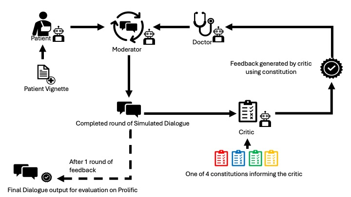

# Evaluating-Constitutions
Code for **Evaluating the role of `Constitutions' for learning from AI feedback** , presented at NeurIPS 2024 in the workshop on [Language Gamification](https://language-gamification.github.io//).



**Evaluating the role of `Constitutions' for learning from AI feedback** explores how different "constitutions" in large language models impact the quality of text generated following AI feedback for improving patient-centered communication in doctor-patient conversations. All the code required to run the experiments for dialogue and feedback generation can be found in this repository.

The cases for patient vignettes were originally obtained from [Agent Clinic](https://agentclinic.github.io).

## How to run code

Install requirements

```
pip install -r requirements.txt
```

To create dialogue, run:

```
python claude_final.py 
```
Time stamped dialogues with the relevant critic feedback at each round from the experiments can be found in the full_conversations folder


## Citation
```bibtex
@article{redgate2024evaluating,
  title={Evaluating the role of `Constitutions' for learning from AI feedback},
  author={Saskia Redgate and Andrew Bean and Adam Mahdi},
  journal={Advances in Neural Information Processing Systems (NeurIPS): Workshop on Language Gamefication},
  volume={38}
  year={2024}
}
```
